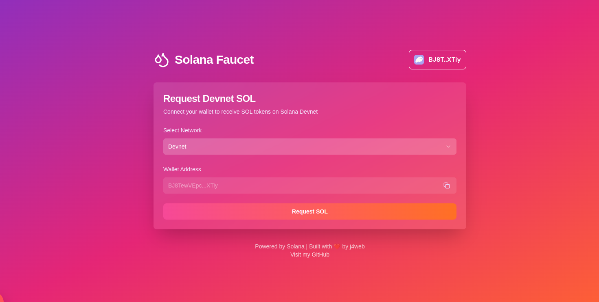
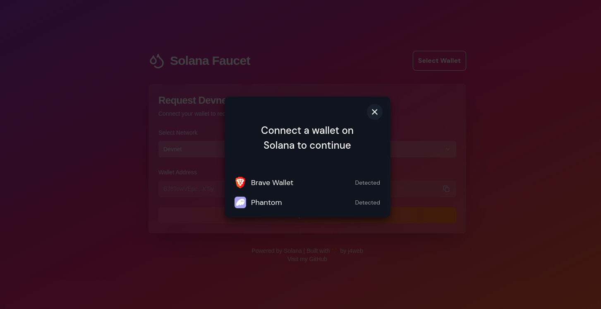

# Solana Faucet

A simple web-based Solana faucet that allows users to claim small amounts of devnet SOL tokens for testing and development purposes. This faucet is ideal for developers needing SOL for deploying contracts, testing transactions, and building on the Solana devnet without requiring real SOL.



## Features

- **Easy SOL Claims:** Get SOL tokens directly on Solana's devnet for quick testing and prototyping.
- **Wallet Integration:** Uses Solana's Wallet Adapter for streamlined wallet connections.
- **User-Friendly UI:** Built with Tailwind CSS for a clean, responsive design.

## Tech Stack

- **Next.js 15**
- **Solana Wallet Adapter**
- **Tailwind CSS** with **tailwind-merge**



## Getting Started

### Prerequisites

- **Node.js** and **npm** (or **yarn**)
- **Solana Wallet** (e.g., Phantom, Sollet)

### Installation

1. Clone this repository:
    ```bash
    git clone https://github.com/yourusername/solana-faucet.git
    cd solana-faucet
    ```

2. Install dependencies:
    ```bash
    npm install
    ```

3. Start the development server:
    ```bash
    npm run dev
    ```

4. Open [http://localhost:3000](http://localhost:3000) in your browser to see the app.

### Environment Variables

Ensure you have a `.env.local` file in your project root with the following environment variables:

```plaintext
NEXT_PUBLIC_SOLANA_NETWORK=devnet
FAUCET_PRIVATE_KEY=<YOUR_FAUCET_PRIVATE_KEY>
